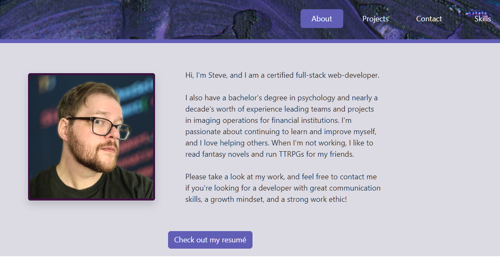

  # React Portfolio

  

  ## Table of Contents
  * [Description](#description)
  * [Usage](#usage)
  * [Questions](#questions)

  ## Description

  A professional portfolio made with React!

  The design is responsive, fast, and oh-so-stable

  

  
    
  ## Usage
  Check out the launched portfolio [HERE!](https://stevengoldbergm.github.io/react-portfolio/)

  Simply use the navigation tabs to move to the different pages of the portfolio. Because of React states, each page loads without refreshing the site.

  ## Questions

  For more information, feel free to contact me:

  GitHub: [github.com/stevengoldbergm](https://github.com/stevengoldbergm)
  